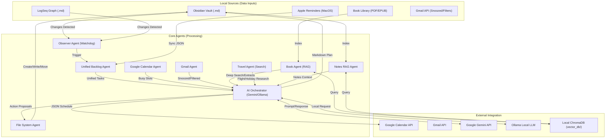

# AI Agent Assistant: System Architecture & Agent Flows

This document provides a technical overview of how the AI Agent Assistant operates, its internal agents, and the flow of data across the system.

## 🏗 System Architecture Diagram

---

## 🤖 Agent Roles & Code Linkage

### 1. Observer Agent (The Watcher)
Monitors specific directories for changes and triggers the synchronization workflow.
- **Code Files:** `main.py`, `observer.py`.

### 2. Unified Backlog Agent (The Aggregator)
Merges tasks from multiple disparate sources into a consistent JSON format for the AI.
- **Code Files:** `main.py`, `reminders_manager.py`, `debug_reminders.py`.

### 3. Calendar Agent (The Context Provider)
Interfaces with the Google Calendar API to provide a "Busy" map of the user's day and sync schedules.
- **Code Files:** `calendar_manager.py`.

### 4. AI Orchestrator Agent (The Scheduler & Router)
The "Brain" of the system. It routes tasks to the appropriate LLM and translates natural language into structured schedules and actions.
- **Code Files:** `ai_orchestration.py`.

### 5. File System Agent (The Actor)
Executes physical changes to the local workspace based on AI proposals.
- **Code Files:** `file_system_agent.py`.

### 6. Book Agent (The Librarian)
Scans, indexes, and deep-searches local book libraries (PDF/EPUB) using RAG.
- **Code Files:** `book_agent.py`.

### 7. Gmail Agent (The Inbox Watcher)
Monitors snoozed and filtered emails to provide additional task context.
- **Code Files:** `gmail_agent.py`.

### 8. RAG Agent (The Context Retriever)
Indexes and retrieves relevant snippets from local markdown notes to ground AI responses.
- **Code Files:** `rag_agent.py`.

### 9. Travel Agent (The Researcher)
Uses Google Search grounding to find real-time flights, itineraries, and travel links.
- **Code Files:** `travel_agent.py`.

---

## 🔄 Data Connection Flow

1.  **Detection:** `watchdog` detects a save in an `.md` file.
2.  **Aggregation:** `get_unified_tasks` scans Obsidian, LogSeq, and Reminders.
3.  **Context:** `get_busy_slots` (Calendar), `get_snoozed_emails` (Gmail), and `query_context` (RAG) provide deep context.
4.  **Decision:** A payload (Backlog + Context + Busy Slots) is sent to the AI via `ai_orchestration`.
5.  **Proposal:** The AI returns a JSON object containing a `schedule` and optional `actions` (e.g., `read_book`, `write_file`).
6.  **Sync & Action:** 
    - `calendar_manager` creates events in Google Calendar.
    - `main.update_markdown_plan` rewrites the `## Today's Plan` section.
    - User confirms and executes `actions` (File system, indexing, etc.).

## 🛠 Configuration Mapping
The agents rely on the `.config` file for their environment:
- `WORKSPACE_DIR` -> **ObserverAgent**, **FSAgent**, **RAGAgent**
- `LOGSEQ_DIR` -> **ObserverAgent**, **RAGAgent**
- `BOOKS_DIR` -> **BookAgent**
- `CALENDAR_ID` -> **CalendarAgent**
- `GEMINI_API_KEY` -> **AIOrcAgent**
- `ROUTING_*` -> **AIOrcAgent**

---

## 🚀 Interfaces
- **Background Observer (`main.py`)**: Persistent daemon mode.
- **Interactive CLI (`main.py --chat`)**: Slash commands and action loops.
- **Web Mission Control (`app.py`)**: Visual backlog management and interactive chat dashboard.
