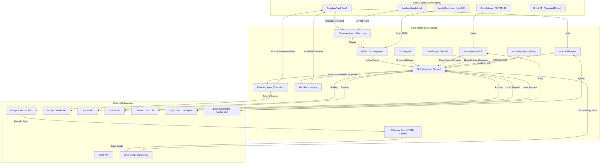

# AI Agent Assistant: System Architecture & Agent Flows

This document provides a technical overview of how the AI Agent Assistant operates, its internal agents, and the flow of data across the system.

## 🏗 System Architecture Diagram

---

## 🤖 Agent Roles & Code Linkage

### 1. Observer Agent (The Watcher)
Monitors specific directories for changes and triggers the synchronization workflow. It specifically scans LogSeq journals for `LATER` tasks.
- **Code Files:** `main.py`, `observer.py`.

### 2. Unified Backlog Agent (The Aggregator)
Merges tasks from multiple disparate sources (Obsidian, LogSeq, Apple Reminders) into a consistent JSON format for the AI.
- **Code Files:** `main.py`, `reminders_manager.py`.

### 3. Monitoring Agent (The Pulse)
Checks the health and availability of local AI servers (Ollama, OpenClaw) to ensure reliable routing.
- **Code Files:** `monitoring_agent.py`.

### 4. Calendar Agent (The Cache Manager)
Runs a background process to sync Google Calendar data to `datainput/googlecalendar.yml`, reducing API latency and preventing rate limits.
- **Code Files:** `calendar_agent.py`, `calendar_manager.py`.

### 5. Planning Agent (The Executor)
Handles the final phase of scheduling: submitting confirmed events to Google Calendar and writing the plan back to Obsidian.
- **Code Files:** `planning_agent.py`.

### 6. AI Orchestrator Agent (The Scheduler & Router)
The "Brain" of the system. It routes tasks between local models (Ollama, OpenClaw) and cloud APIs (Gemini, OpenAI, Claude).
- **Code Files:** `ai_orchestration.py`.

### 7. File System Agent (The Actor)
Executes physical changes to the local workspace based on AI proposals.
- **Code Files:** `file_system_agent.py`.

### 8. Book Agent (The Librarian)
Scans, indexes, and deep-searches local book libraries (PDF/EPUB) using RAG.
- **Code Files:** `book_agent.py`.

### 9. Gmail Agent (The Inbox Watcher)
Monitors snoozed and filtered emails to provide additional task context.
- **Code Files:** `gmail_agent.py`.

### 10. RAG Agent (The Context Retriever)
Indexes and retrieves relevant snippets from local markdown notes to ground AI responses.
- **Code Files:** `rag_agent.py`.

### 11. Travel Agent (The Researcher)
Uses Google Search grounding to find real-time flights, itineraries, and travel links.
- **Code Files:** `travel_agent.py`.

---

## 🔄 Data Connection Flow

1.  **Detection:** `watchdog` detects a save or a new `LATER` task in LogSeq.
2.  **Aggregation:** `get_unified_tasks` scans Obsidian, LogSeq, and Reminders.
3.  **Context:** `CalendarAgent` (via YAML), `GmailAgent`, and `RAGAgent` provide deep context.
4.  **Decision:** A payload is sent to the AI via `ai_orchestration` after `MonitoringAgent` confirms server health.
5.  **Proposal:** The AI returns a JSON object containing a `schedule` and optional `actions`.
6.  **Sync & Action:** 
    - `PlanningAgent` commits events to Google Calendar and Obsidian.
    - User confirms and executes `actions` via `FileSystemAgent`.

## 🛠 Configuration Mapping
The agents rely on the `.config` file for their environment:
- `WORKSPACE_DIR` -> **ObserverAgent**, **FSAgent**, **RAGAgent**
- `LOGSEQ_DIR` -> **ObserverAgent**, **RAGAgent**
- `BOOKS_DIR` -> **BookAgent**
- `CALENDAR_ID` -> **CalendarAgent**, **PlanningAgent**
- `ROUTING_*` -> **AIOrcAgent**
- `ENABLE_*` -> **AIOrcAgent**, **MonitoringAgent**

---

## 🚀 Interfaces
- **Background Observer (`main.py`)**: Persistent daemon mode with background calendar sync.
- **Interactive CLI (`main.py --chat`)**: Slash commands and action loops.
- **Web Mission Control (`app.py`)**: Visual backlog management and interactive chat dashboard.
