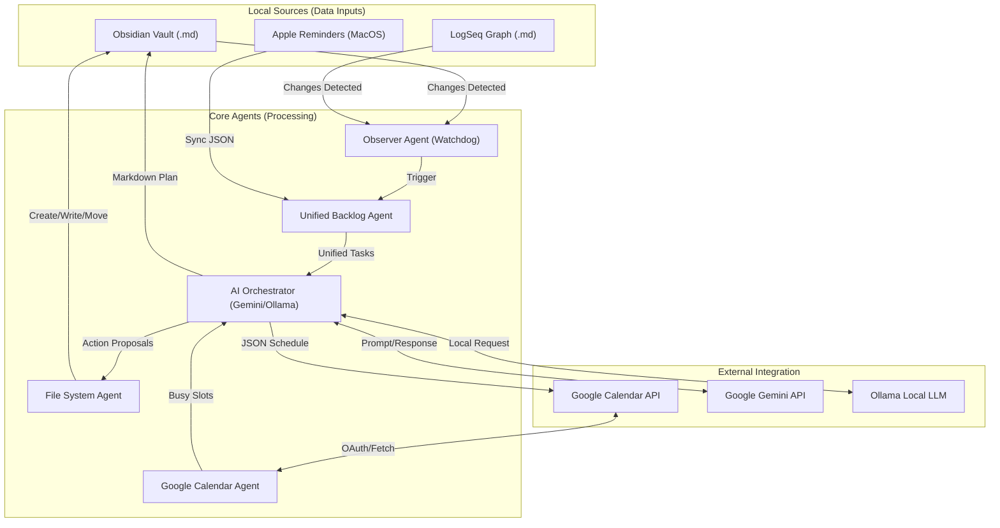

# AI Agent Assistant: System Architecture & Agent Flows

This document provides a technical overview of how the AI Agent Assistant operates, its internal agents, and the flow of data across the system.

## 🏗 System Architecture Diagram

---

## 🤖 Agent Roles & Code Linkage

### 1. Observer Agent (The Watcher)
Monitors specific directories for changes and triggers the synchronization workflow.
- **Key Functions:**
    - `main.TaskSyncHandler.on_modified`: Debounces and triggers sync.
    - `observer.parse_markdown_tasks`: Extracts tasks from Obsidian `## Tasks`.
    - `observer.parse_logseq_tasks`: Extracts tasks from LogSeq journals and pages.
- **Code Files:** `main.py`, `observer.py`.

### 2. Unified Backlog Agent (The Aggregator)
Merges tasks from multiple disparate sources into a consistent JSON format for the AI.
- **Key Functions:**
    - `main.get_unified_tasks`: Orchestrates multi-source fetching.
    - `reminders_manager.get_apple_reminders`: Loads local JSON reminders.
    - `debug_reminders.py`: (macOS) Directly extracts from Apple Reminders app.
- **Code Files:** `main.py`, `reminders_manager.py`, `debug_reminders.py`.

### 3. Calendar Agent (The Context Provider)
Interfaces with the Google Calendar API to provide a "Busy" map of the user's day.
- **Key Functions:**
    - `calendar_manager.get_calendar_service`: Handles OAuth2 authentication.
    - `calendar_manager.get_busy_slots`: Fetches today's appointments.
    - `calendar_manager.create_events`: Commits the AI's schedule to the cloud.
- **Code Files:** `calendar_manager.py`.

### 4. AI Orchestrator Agent (The Scheduler)
The "Brain" of the system. It routes tasks to the appropriate LLM and translates natural language into structured schedules and actions.
- **Key Functions:**
    - `ai_orchestration.generate_schedule`: Builds the complex prompt and parses the AI response.
    - `ai_orchestration.get_routing`: Decides between Gemini (Remote) and Ollama (Local).
    - `ai_orchestration.ollama_generate`: Handles local inference calls.
- **Code Files:** `ai_orchestration.py`.

### 5. File System Agent (The Actor)
Executes physical changes to the local workspace based on AI proposals.
- **Key Functions:**
    - `file_system_agent.create_folder`: Safe directory creation.
    - `file_system_agent.write_file`: Safe file creation/overwriting.
    - `file_system_agent.move_file`: Safe file reorganization.
- **Code Files:** `file_system_agent.py`.

---

## 🔄 Data Connection Flow

1.  **Detection:** `watchdog` detects a save in an `.md` file.
2.  **Aggregation:** `get_unified_tasks` is called, scanning Obsidian, LogSeq folders, and the local Reminders cache.
3.  **Context:** `get_busy_slots` fetches existing commitments from Google Calendar.
4.  **Decision:** A payload (Backlog + Busy Slots + Time) is sent to the AI via `ai_orchestration`.
5.  **Proposal:** The AI returns a JSON object containing a `schedule` and optional `actions`.
6.  **Sync:** 
    - `calendar_manager` creates events in Google Calendar.
    - `main.update_markdown_plan` rewrites the `## Today's Plan` section in your note.
    - `execute_actions` (if confirmed by user) calls the `FileSystemAgent` to modify the vault.

## 🛠 Configuration Mapping
The agents rely on the `.config` file for their environment:
- `WORKSPACE_DIR` -> **ObserverAgent**, **FSAgent**
- `LOGSEQ_DIR` -> **ObserverAgent**
- `CALENDAR_ID` -> **CalendarAgent**
- `GEMINI_API_KEY` -> **AIOrcAgent**
- `ROUTING_*` -> **AIOrcAgent**

---

## 🚀 Seamless Execution
The system is designed to run without manual environment management. 
- **Launcher Script (`./assistant`)**: Automatically wraps commands in the virtual environment.
- **Makefile**: Provides shortcut targets for all major functions (e.g., `make run`, `make run-chat`).
- **Cron Service**: Enables background operation without a persistent terminal session.
