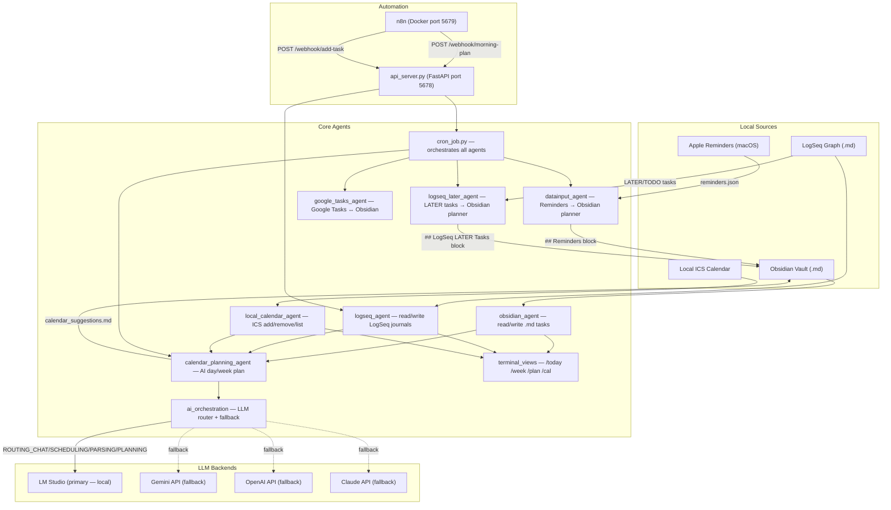

# AI Agent Assistant — System Architecture & Agent Flows

This document provides a technical overview of how the AI Agent Assistant operates, its internal agents, and the flow of data across the system.

---

## System Architecture


```mermaid
graph TD
    subgraph "Local Sources"
        Obsidian["Obsidian Vault (.md)"]
        LogSeq["LogSeq Graph (.md)"]
        AppleRem["Apple Reminders (macOS)"]
        ICS["Local ICS Calendar"]
    end

    subgraph "Core Agents"
        DataInput["datainput_agent — Reminders → Obsidian planner"]
        LogSeqLater["logseq_later_agent — LATER tasks → Obsidian planner"]
        CalPlan["calendar_planning_agent — AI day/week plan"]
        CronJob["cron_job.py — orchestrates all agents"]
        TermViews["terminal_views — /today /week /plan /cal"]
        ObsAgent["obsidian_agent — read/write .md tasks"]
        LSAgent["logseq_agent — read/write LogSeq journals"]
        LocalCal["local_calendar_agent — ICS add/remove/list"]
        GTasks["google_tasks_agent — Google Tasks ↔ Obsidian"]
        AIOrch["ai_orchestration — LLM router + fallback"]
    end

    subgraph "LLM Backends"
        LMStudio["LM Studio (primary — local)"]
        Gemini["Gemini API (fallback)"]
        OpenAI["OpenAI API (fallback)"]
        Claude["Claude API (fallback)"]
    end

    subgraph "Automation"
        N8N["n8n (Docker port 5679)"]
        APIServer["api_server.py (FastAPI port 5678)"]
    end

    %% Data flows
    AppleRem -->|reminders.json| DataInput
    DataInput -->|## Reminders block| Obsidian
    LogSeq -->|LATER/TODO tasks| LogSeqLater
    LogSeqLater -->|## LogSeq LATER Tasks block| Obsidian
    Obsidian --> ObsAgent
    LogSeq --> LSAgent
    ICS --> LocalCal

    %% Planning pipeline
    ObsAgent --> CalPlan
    LSAgent --> CalPlan
    LocalCal --> CalPlan
    CalPlan -->|calendar_suggestions.md| Obsidian
    CronJob --> DataInput
    CronJob --> LogSeqLater
    CronJob --> CalPlan
    CronJob --> GTasks

    %% Terminal views
    ObsAgent --> TermViews
    LSAgent --> TermViews
    LocalCal --> TermViews

    %% LLM routing
    AIOrch -->|ROUTING_CHAT/SCHEDULING/PARSING/PLANNING| LMStudio
    AIOrch -.->|fallback| Gemini
    AIOrch -.->|fallback| OpenAI
    AIOrch -.->|fallback| Claude
    CalPlan --> AIOrch

    %% n8n automation
    N8N -->|POST /webhook/morning-plan| APIServer
    APIServer --> CronJob
    N8N -->|POST /webhook/add-task| APIServer
    APIServer --> LSAgent
```

---

## Agent Roles

### datainput_agent
Reads `datainput/reminders.json` (Apple Reminders export), deduplicates against `datainput/synced_reminders.json`, and appends new tasks to the Obsidian planner under `## Reminders`. Optionally calls the LLM to re-organise the full planner.

- **Entry**: `run(organise=True)`
- **Writes**: Obsidian `Planner.md` (or `OBSIDIAN_PLANNER_FILE`)

### logseq_later_agent
Scans LogSeq journals (last N days, default 30) and all pages for `LATER`-marked tasks. Deduplicates by task text and writes a `## LogSeq LATER Tasks` block to the Obsidian planner.

- **Entry**: `run(write_to_obsidian=True)`
- **Config**: `LOGSEQ_JOURNAL_DAYS`, `LOGSEQ_DIR`, `OBSIDIAN_PLANNER_FILE`

### calendar_planning_agent
Fetches calendar events (local ICS → n8n YAML cache fallback), loads Apple Reminders and LogSeq tasks, and sends everything to the configured LLM (`ROUTING_PLANNING`) to generate a concrete day-by-day plan. Saves to `datainput/calendar_suggestions.md` and optionally appends to the Obsidian planner.

- **Entry**: `generate_plan(days=7, write_to_obsidian=False)`
- **LLM**: routes via `ROUTING_PLANNING` (default: LLM_PRIORITY chain → LM Studio)

### local_calendar_agent
Manages a local RFC 5545 ICS file (`datainput/local_calendar.ics`). Supports add, remove, list, today, export, and import — no Google OAuth required.

- **CLI commands**: `/add-event`, `/remove-event`, `/export-calendar`, `/import-calendar`

### google_tasks_agent
Pulls tasks from Google Tasks into Obsidian planner; pushes `[x]` completions from Obsidian back to Google Tasks. Auth managed via n8n (no token.json in Python).

- **Entry**: `run()`
- **CLI command**: `/google-tasks`

### terminal_views
Rich terminal rendering for calendar and task data. All views read from Obsidian + LogSeq + Apple Reminders via `_load_unified_tasks()` and from the local ICS calendar.

| View | Command | Description |
|------|---------|-------------|
| Today | `/today` | Events + tasks due today; overdue in red |
| Week | `/week` | 7-day count summary (events + tasks per day) |
| Plan | `/plan [horizon]` | Tasks bucketed: today / week / month / year / backlog |
| Cal grid | `/cal [month year]` | Month grid; `*`=event `•`=task `‼`=both |
| Cal day | `/cal-day YYYY-MM-DD` | Single-day drill-down |

### ai_orchestration
The LLM router. Routes requests to the correct backend based on `ROUTING_*` config keys. Falls back through `LLM_PRIORITY` chain if the primary is unavailable.

- **Providers**: `lmstudio`, `ollama`, `gemini`, `openai`, `claude`
- **Key functions**: `generate(prompt)`, `generate_with(provider, prompt)`, `generate_stream(prompt)`

### cron_job.py
Orchestrates all agents in sequence with a lockfile (prevents concurrent runs) and a 5-minute hard timeout. Run directly or triggered via n8n's `POST /webhook/morning-plan`.

```bash
python cron_job.py                              # all agents
python cron_job.py --agents datainput logseq    # specific agents
```

### api_server.py (FastAPI)
Webhook server for n8n integration. Runs on `WEBHOOK_PORT` (default 5678).

| Endpoint | Description |
|----------|-------------|
| `POST /webhook/add-task` | Add a task to today's LogSeq journal |
| `GET /webhook/backlog` | Return unified task backlog as JSON |
| `POST /webhook/plan` | Trigger scheduling via ai_orchestration |
| `POST /webhook/morning-plan` | Full pipeline: datainput → logseq → AI plan |
| `GET /health` | Health check (Ollama status, LOGSEQ_DIR) |

---

## Data Flow — Morning Plan Pipeline

```
08:00 weekdays
  n8n schedule trigger
    → POST http://api:5678/webhook/morning-plan
      → datainput_agent.run()          # Apple Reminders → Obsidian
      → logseq_later_agent.run()       # LogSeq LATER → Obsidian
      → calendar_planning_agent        # LM Studio → day/week plan
        → datainput/calendar_suggestions.md
      → return {status, steps, plan}
    ← n8n formats summary
```

---

## Configuration Reference

| Key | Default | Description |
|-----|---------|-------------|
| `ENABLE_LM_STUDIO` | `false` | Enable LM Studio backend |
| `LM_STUDIO_MODEL` | — | Model name loaded in LM Studio |
| `ENABLE_OLLAMA` | `true` | Enable Ollama backend |
| `OLLAMA_MODEL` | `llama3:latest` | Ollama model name |
| `LLM_PRIORITY` | `ollama,gemini,openai,claude` | Fallback chain |
| `ROUTING_CHAT` | `ollama` | LLM for chat |
| `ROUTING_SCHEDULING` | `ollama` | LLM for scheduling |
| `ROUTING_PARSING` | `ollama` | LLM for parsing |
| `ROUTING_PLANNING` | _(uses LLM_PRIORITY)_ | LLM for daily plan |
| `WORKSPACE_DIR` | — | Obsidian vault root |
| `LOGSEQ_DIR` | — | LogSeq graph root |
| `OBSIDIAN_PLANNER_FILE` | `Planner.md` | Planner note relative path |
| `LOGSEQ_JOURNAL_DAYS` | `30` | Days of journals to scan |
| `DEEP_WORK_START/END` | `09:00`/`12:00` | Focus window for plan |
| `CHRONOTYPE` | `morning_owl` | Affects plan scheduling |
| `N8N_WEBHOOK_URL` | `http://localhost:5678/webhook` | n8n base URL |
| `WEBHOOK_PORT` | `5678` | api_server.py port |

---

## Sprint History

| Sprint | Goal | Status |
|--------|------|--------|
| 01 | Remove OpenClaw, Ollama-first LLM, LogSeq parsing, n8n webhooks | ✅ |
| 02 | Obsidian direct parsing, LogSeq→Obsidian sync, `--plan` flag, cron safety | ✅ |
| 03 | Per-task LLM routing, `config.example`, evening review | ✅ |
| 04 | `main.py` refactor, test suite (42 tests), Rich status dashboard, `/today` + `/week` | ✅ |
| 05 | Local ICS calendar engine, Google Tasks two-way sync | ✅ |
| 06 | LM Studio adapter, NanoClaw containerised Obsidian + LogSeq skills | ✅ |
| 07 | LM Studio native SDK, `lms` CLI lifecycle, n8n local setup, Google OAuth → n8n | ✅ |
| 08 | `/plan` time-horizon buckets, `/cal` month grid, Ollama/LM Studio planning, n8n morning-plan webhook | ✅ |
